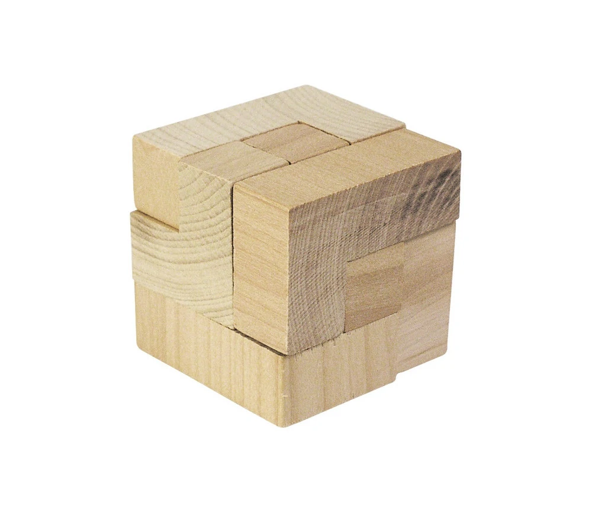
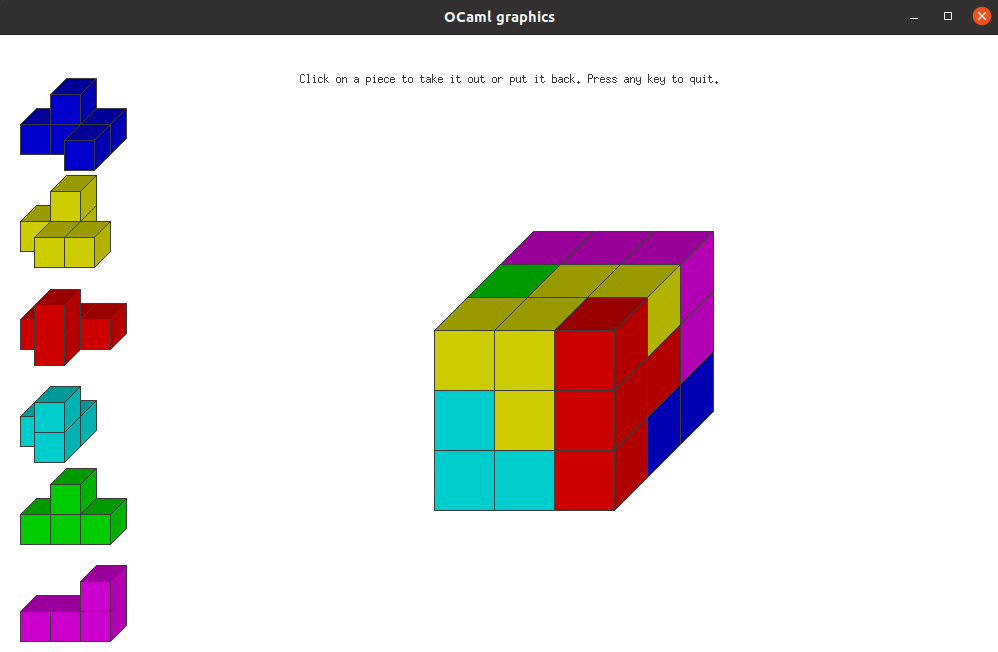
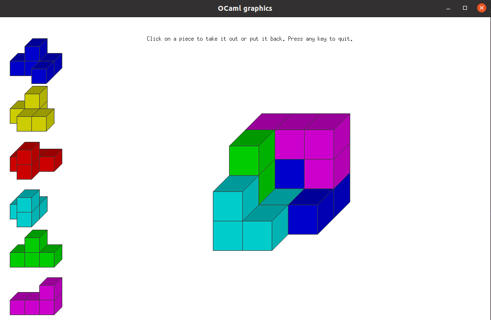
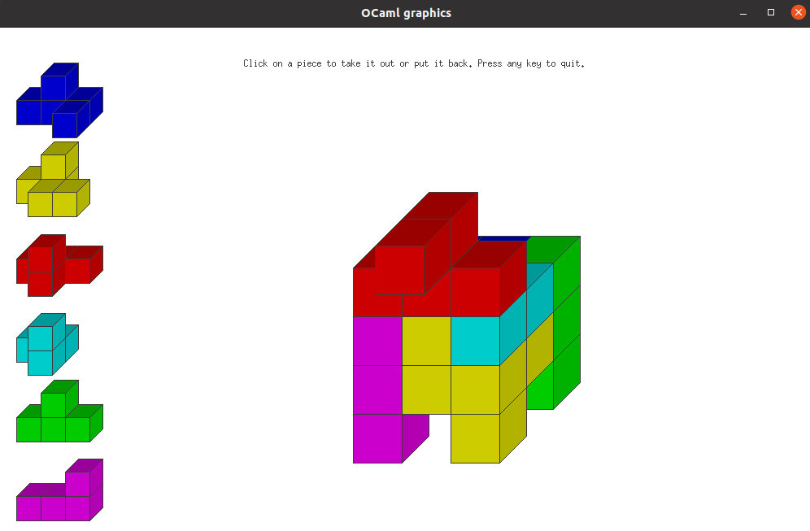
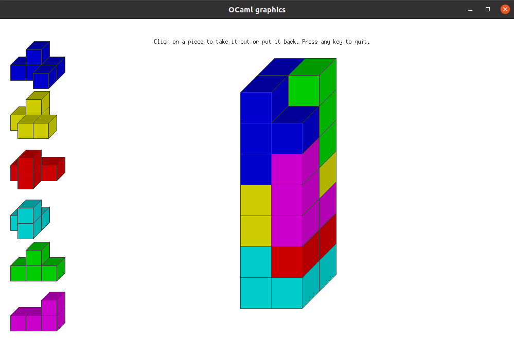

# cubzzle

[](https://github.com/mbarbin/cubzzle/actions/workflows/ci.yml)
[](https://coveralls.io/github/mbarbin/cubzzle?branch=main)

This is a toy project implementing a brute force solver for a small wooden
puzzle that I use to have at home.

## What's the puzzle ?

There are 6 wooden pieces made of small cubes that can fit into a 3x3x3 box.



## What does the solver do ?

The solver finds a solution and displays it in a Graphics window.



So that one can see exactly how the pieces fit, the display allows for
inspecting pieces individually.



## Other shapes

You can assemble the same pieces into other shapes as well, such as a Dog:



or a Tower, etc.



## Install

Releases for this project are published to a custom opam-repo. To add it to your
current opam switch, run:

```sh
opam repo add mbarbin https://github.com/mbarbin/opam-repository.git
```

Then you can install `cubzzle` using a normal opam workflow.

```sh
opam install cubzzle
```

## Running the code

The following command will open an OCaml Graphics window and run the solver:

```bash
$ cubzzle run
```

A few shapes are available (Cube, Dog, Tower, etc.). To solve a different shape,
provide the option `-shape`. You can also draw the box during the brute force
search, to see the solver run through all permutations interactively.

```bash
$ cubzzle run -shape Tower -draw-box-during-search true
```

## Motivations

I wanted to have a small code sample using OCaml Graphics on GitHub.

## Code documentation

The code documentation of the latest release is built with `odoc` and published
to `GitHub` pages [here](https://mbarbin.github.io/cubzzle).
